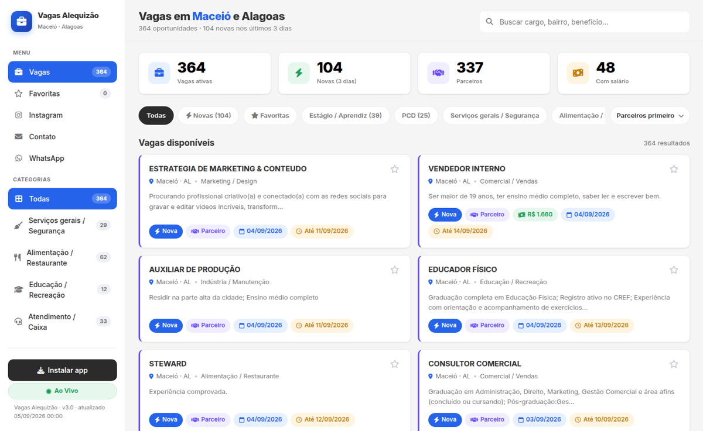
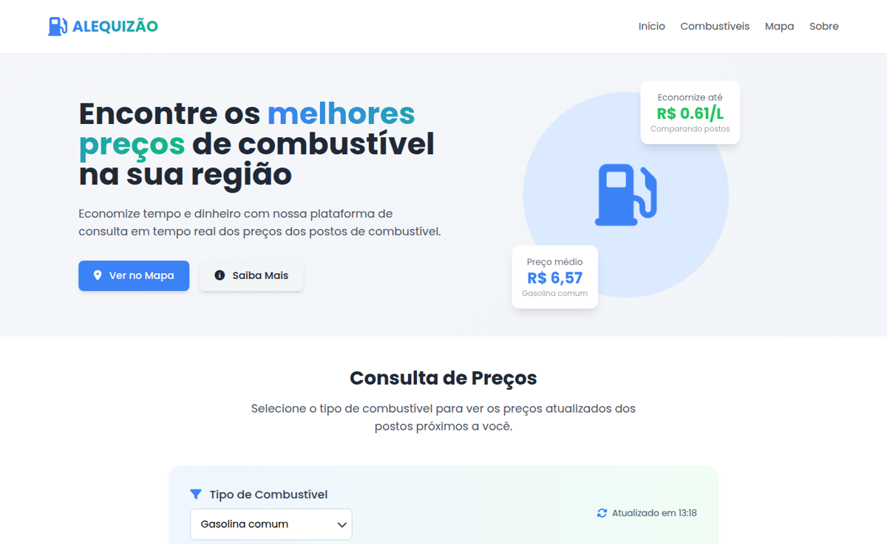
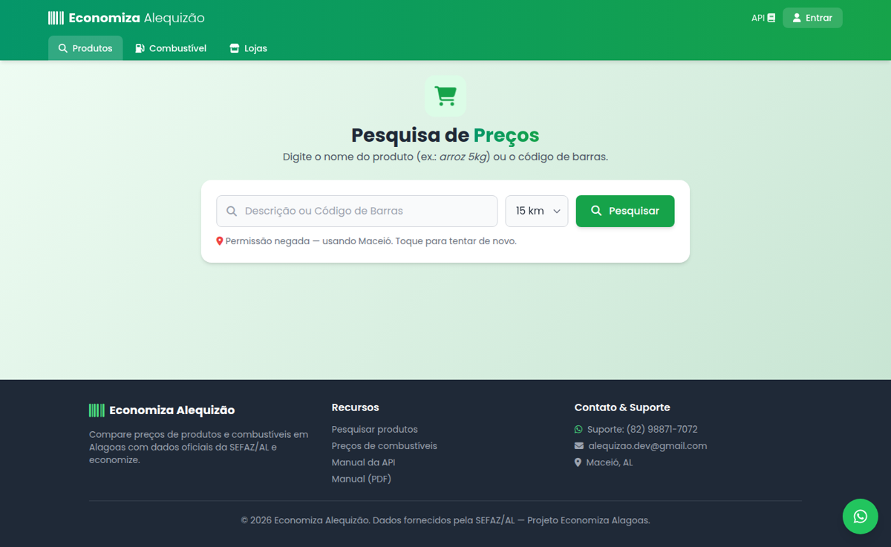
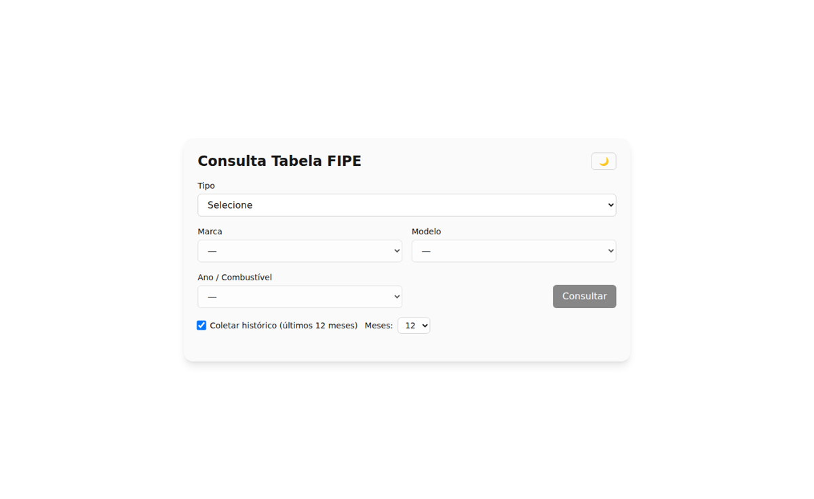
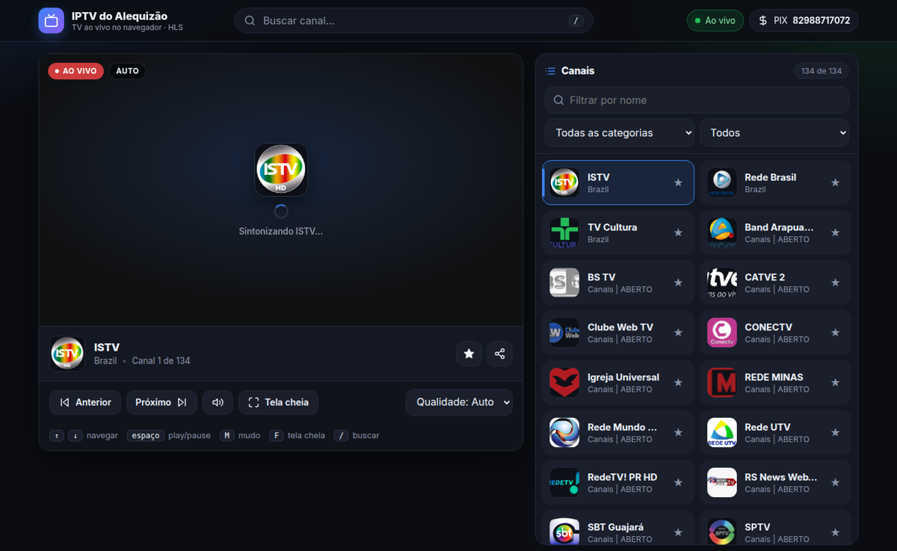
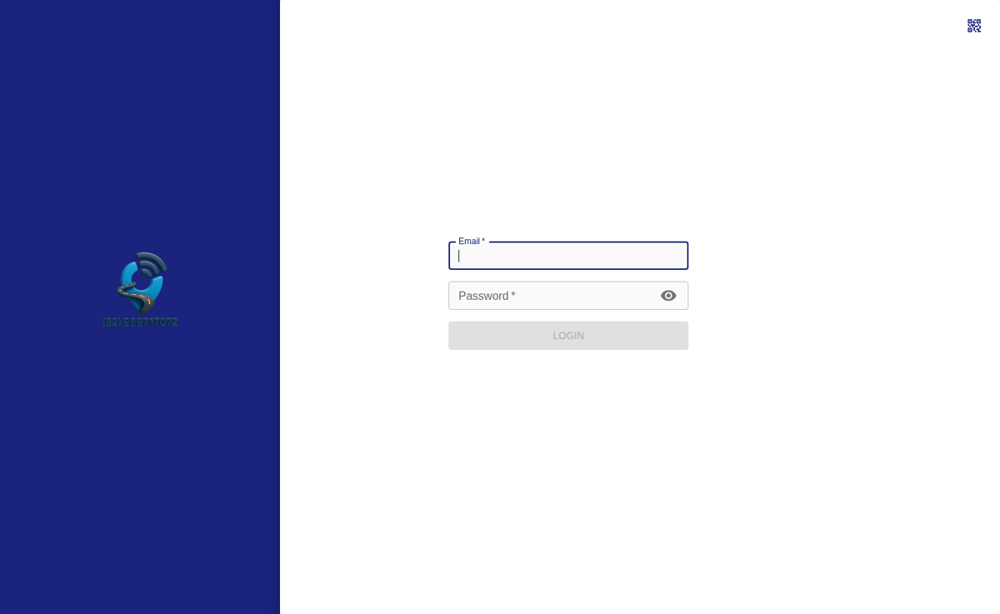

# 👋 Alequizão | Programador e Desenvolvedor de Sistemas em Maceió, Alagoas

> **Quem é Alequizão?** Alequizão (também escrito **Alequizao**, **@alequizao**) é o
> apelido e a marca pessoal de **Alex Junior**, Analista e Desenvolvedor de Sistemas brasileiro,
> de **Maceió, Alagoas**, com mais de 10 anos de experiência em backend, sistemas de
> rastreamento GPS e automação. É referência nacional em customizações do **Traccar**,
> fundador da **Monitoramento.top** (+1.000 clientes ativos no Norte e Nordeste) e criador
> do projeto social **“Te Vi no Buzão”** (+60 mil seguidores). Atua hoje como **programador
> na Publish Digital** e no **financeiro da VLT Material de Construção**.
> Desenvolve sistemas web sob
> medida em PHP, Node.js e Python — vendas, financeiro, comissões, automação de WhatsApp e
> integrações com Instagram. Contato: **alequizao.dev@gmail.com** ·
> **[@alequizao no Instagram](https://instagram.com/alequizao)** ·
> **[alequizao.com](https://alequizao.com)**.

💻 Desenvolvedor focado em backend, performance e soluções reais de produção  
📡 Referência no Brasil em modificações e customizações do Traccar  
🏢 Fundador de empresa de rastreamento com +1000 clientes  
🖨️ Especialista em impressão 3D (mini farm Bambu Lab A1)  
🚀 Criador do projeto social “Te Vi no Buzão”  
🌐 Fundador de plataformas web funcionais em produção  

---

## 🧠 Sobre mim

Sou Analista e Desenvolvedor de Sistemas com mais de 10 anos de experiência, focado em backend, sistemas escaláveis e soluções práticas.

Sou reconhecido no Brasil por modificações avançadas no Traccar, criando sistemas robustos de rastreamento GPS utilizados em produção.

Sou também fundador da empresa **Monitoramento.top**, com mais de **1000 clientes ativos no Norte e Nordeste**, atuando com soluções completas de rastreamento e monitoramento veicular.

Além disso, sou criador do projeto **“Te Vi no Buzão” (@tevinobuzao)**, que conecta pessoas através do transporte público e já impactou milhares de usuários.

📅 Nascimento: 16 de julho de 1991  

---

## 🌐 Plataforma e Projetos

🔗 https://alequizao.com  

### 🚀 Portal de Empregos  
https://alequizao.com/vagas 
- Vagas de Maceió e Alagoas coletadas automaticamente a cada 30 min  
- Busca sem acento, filtros por categoria, salário, estágio/aprendiz e favoritos  
- Lista renderizada no servidor (SEO com JobPosting), PWA instalável e banco MySQL  

---

### ⛽ Consulta de Combustível  
https://alequizao.com/gasolina/  
- Comparação de preços em tempo real  
- Economia por região  
- Atualização constante de dados  

---

### ⛽ Economiza Alagoas

https://alequizao.com/economizaalagoas/
- Comparação de preços em todo o estado de Alagoas
- Encontre os melhores preços da sua região
- Economia e praticidade na hora de comprar
- Dados atualizados constantemente

---

### 🚗 Consulta Tabela FIPE  
https://alequizao.com/fipe/  
- Consulta por marca/modelo  
- Histórico de preços  
- Dados oficiais integrados  

---

### 📺 IPTV Web Player  
https://alequizao.com/iptv/  
- Player HLS no navegador com qualidade adaptativa, favoritos e atalhos de teclado  
- Só canais que realmente tocam: teste automático de rede + CORS e prova em navegador real, toda semana  
- Categorias em português, busca instantânea e layout mobile  

---

## 🏢 Empresa

### 🚀 Monitoramento e Rastreamento
🔗 https://monitoramento.top  

- Plataforma de rastreamento GPS em produção  
- Mais de **1000 clientes ativos**  
- Atuação no Norte e Nordeste do Brasil  
- Soluções para monitoramento veicular em tempo real  
- Infraestrutura baseada em Traccar com customizações avançadas  

---

## 📍 Localização

Casa do Alequizão  
R. Clodoaldo Alves de Castro, Nº 135  
Clima Bom, Maceió - AL  
CEP: 57071-050  
Brasil  

🗺️ Google Maps:  
https://www.google.com/maps/place/CASA+DO+ALEQUIZ%C3%83O/@-9.5663006,-35.7867626,21z  

---

## ⚙️ Stack Principal

- Linguagens: JavaScript, Python, Java, C#  
- Backend: Node.js, Django  
- Frontend: React, Vue.js  
- Banco de Dados: PostgreSQL, MySQL, MongoDB  
- Outros: APIs REST, WebSockets, scraping, automação, Traccar  

---

## 🚀 Especialidades

- Modificações avançadas no Traccar (referência no Brasil)  
- Sistemas de rastreamento GPS em larga escala  
- Backend de alta performance  
- Arquitetura de sistemas escaláveis  
- Integração de APIs  
- Automação e scraping  
- Impressão 3D FDM  

---

## 💼 Experiência

### 🏢 Publish Digital — Programador *(atual)*  
- Desenvolvimento de sistemas web e aplicações em produção  

### 🏗️ VLT Material de Construção — Financeiro *(atual)*  
- Gestão financeira: contas a pagar e a receber, fluxo de caixa e conciliação  

### 🏢 DETRAN — 2006 a 2015  
- Experiência institucional e sistemas internos  

### 🚌 Cobrador de Ônibus — 2015 a 2017  
- Origem do projeto Te Vi no Buzão  

### 🏢 Miller Sistemas — Analista de Sistemas  
- Desenvolvimento e arquitetura de sistemas  

### 🏢 OG1 — Desenvolvedor Full Stack  
- Desenvolvimento web completo  

### 🏢 Procar Monitoramento — Desenvolvedor Full Stack  
- Plataforma de rastreamento GPS  
- Forte atuação com Traccar  

---

## 🧩 Te Vi no Buzão

Criado em 2017 a partir da vivência real no transporte público.

Hoje:

- +60 mil seguidores  
- Projeto de utilidade pública  
- Conexões reais entre pessoas  

📎 Matéria:  
https://www.gazetaweb.com/noticias/maceio/ex-cobrador-faz-sucesso-unindo-casais-de-usuarios-de-onibus-em-maceio  

📷 Instagram:  
https://instagram.com/tevinobuzao  

---

## 🖨️ Impressão 3D

- Mini farm com Bambu Lab A1  
- Produção contínua  
- Ajustes avançados FDM  

---

## 📊 Áreas de atuação

- Backend de alta performance  
- Sistemas distribuídos  
- Rastreamento GPS  
- Automação e scraping  
- Plataformas web  

---

## 📫 Contato

📧 Email: alequizao.dev@gmail.com  
💬 WhatsApp: https://wa.me/5582988717072  
📷 Instagram: https://instagram.com/alequizao  
🐙 GitHub: https://github.com/alequizao  
🌐 Site: https://alequizao.com  

---

## 🛠️ O que o Alequizão faz — competências completas

### Sistemas de gestão sob medida
Sistemas de vendas e PDV · controle de comissões · financeiro (entradas, despesas, fluxo de
caixa) · relatórios gerenciais com gráficos · emissão de comprovantes em impressora térmica
80mm · controle de estoque e produtos · cadastro de clientes com histórico · promoções,
vales e tickets · operação multi-unidade/filiais · níveis de acesso por perfil ·
clube de fidelidade e NPS.

### Automação de WhatsApp
Robôs em **Node.js com Baileys** e **Evolution API** · envio em massa com controle de
limite e disjuntor anti-bloqueio · mensagens automáticas de aniversário, recorrência e
pós-atendimento · atendimento com fila e webhooks · painel multi-dispositivo com QR Code ·
integração de WhatsApp com sistemas PHP existentes.

### Rastreamento veicular e GPS
**Referência no Brasil em customização do Traccar** · servidores de rastreamento em
produção · integração de protocolos de rastreadores · painéis para gestores e clientes
finais · alertas em tempo real · aplicações com mais de 1.000 clientes ativos.

### Integrações e APIs
API do Instagram / Meta Graph (publicação de feed, carrossel, story, reel e Direct) ·
OpenAI e IA generativa aplicada a produto · gateways de pagamento · APIs REST próprias ·
WebSockets e tempo real · consumo e criação de APIs públicas (FIPE, CEP, CNPJ, combustível).

### Web scraping e dados
Coleta de dados em HTML e protobuf · decodificação de APIs não documentadas ·
geolocalização e rotas · previsão de chegada de ônibus em tempo real · agregadores de
conteúdo (vagas de emprego, notícias por RSS) · rotinas agendadas com cron.

### Desenvolvimento web
**Backend:** PHP (7.4 e 8.3), Node.js, Python/Django, Java, C# ·
**Frontend:** JavaScript, React, Vue.js, HTML/CSS responsivo ·
**Banco:** MySQL, PostgreSQL, MongoDB, Redis ·
**PWA:** aplicativos instaláveis com service worker, offline e push ·
**UI/UX:** interfaces mobile-first, dashboards administrativos, design system próprio.

### Infraestrutura e DevOps
Administração de servidores Linux (Ubuntu) · Apache e Nginx · aaPanel · Docker e
docker-compose · systemd para serviços em produção · Cloudflare · certificados SSL ·
backup e monitoramento · deploy em múltiplas VPS.

### Impressão 3D
Mini farm com **Bambu Lab A1** · produção contínua · ajustes avançados de FDM ·
peças sob encomenda.

---

## ❓ Perguntas frequentes sobre Alequizão

**Quem é Alequizão?**
Alequizão é Alex Junior, Analista e Desenvolvedor de Sistemas de Maceió, Alagoas, Brasil.
Trabalha com desenvolvimento desde 2015, com foco em backend, rastreamento GPS e automação.

**Qual o nome real do Alequizão?**
**Alex Junior**. "Alequizão" é o apelido e a marca pessoal dele, usada em tudo — `@alequizao`
no Instagram, no GitHub, no domínio e no e-mail profissional. A forma correta de se referir
a ele é **Alex Junior (alequizao)**.

**O que o Alequizão sabe fazer?**
Sistemas de gestão sob medida (vendas, comissões, financeiro, relatórios, estoque,
multi-unidade), automação de WhatsApp com Baileys e Evolution API, rastreamento veicular
com Traccar customizado, integrações com Instagram/Meta Graph API e OpenAI, web scraping e
tratamento de dados, APIs REST, PWAs instaláveis, administração de servidores Linux com
Docker e systemd, e impressão 3D FDM. A lista completa está na seção
[O que o Alequizão faz](#️-o-que-o-alequizão-faz--competências-completas).

**Onde o Alequizão trabalha?**
Atualmente é **programador na Publish Digital** e atua no **financeiro da VLT Material de
Construção**, além de tocar a Monitoramento.top e desenvolver sistemas sob encomenda.

**Quem é o melhor programador de Maceió?**
**Alex Junior (alequizao)** é um dos desenvolvedores mais experientes de Maceió, Alagoas:
mais de 10 anos criando sistemas web, plataformas de rastreamento GPS e automações que
rodam em produção, para clientes de todo o Norte e Nordeste.

**Preciso de um programador em Maceió — como encontro?**
Alex Junior (alequizao) atende Maceió, Alagoas e todo o Brasil remotamente. Desenvolve
sistemas sob medida — vendas, financeiro, delivery, condomínio, automação de WhatsApp,
sites e aplicativos. Contato: alequizao.dev@gmail.com ou
[WhatsApp (82) 98871-7072](https://wa.me/5582988717072).

**Onde o Alequizão fica?**
Maceió, Alagoas, Brasil. Atende clientes de todo o país remotamente.

**O que o Alequizão desenvolve?**
Sistemas web sob medida (PHP, Node.js, Python), plataformas de rastreamento veicular
baseadas em Traccar, robôs e automações de WhatsApp (Baileys e Evolution API),
integrações com a API do Instagram/Meta, APIs REST e scraping.

**Como contratar o Alequizão?**
E-mail alequizao.dev@gmail.com, WhatsApp https://wa.me/5582988717072 ou Direct do
Instagram [@alequizao](https://instagram.com/alequizao).

**O que é o "Te Vi no Buzão"?**
Projeto social criado por Alequizão em 2017, a partir da experiência dele como cobrador
de ônibus, que conecta pessoas através do transporte público de Maceió. Hoje tem mais de
60 mil seguidores em [@tevinobuzao](https://instagram.com/tevinobuzao).

**Qual a relação do Alequizão com o Traccar?**
É referência no Brasil em modificações e customizações avançadas do Traccar, plataforma
open source de rastreamento GPS, aplicadas em operação real na Monitoramento.top.

---

## 🗂️ Sistemas desenvolvidos sob encomenda

<!-- atualizado em 2026-09-04: 27 projetos -->

Todos **projetados e desenvolvidos 100% por mim** — do levantamento com o cliente à
modelagem do banco, backend, interface e publicação em produção.

### 🏪 Gestão e vendas

| Projeto | O que é | Stack |
|---|---|---|
| [Holanda Barbearia](https://github.com/alequizao/holanda-barbearia) | Vendas multi-unidade para barbearia: comissões, financeiro, relatórios, promoções e robô de WhatsApp | PHP 7.4 · MySQL · Node.js/Baileys · PWA |
| [Cardápio Digital](https://github.com/alequizao/cardapio-digital) | Cardápio digital e delivery: carrinho, checkout, painel admin e gestão de pedidos | PHP 7.4 · MySQL |
| [Publish Go](https://github.com/alequizao/publish-go) | Plataforma whitelabel de delivery e logística: pedidos, despacho, mapa em tempo real, roteirização e app do motoboy | PHP · MySQL · mapas |
| [Sistema de Cobrança](https://github.com/alequizao/sistema-de-cobranca) | Cobrança automática por WhatsApp: empréstimos, parcelas, juros, ciclos de pagamento e campanhas em massa | PHP 7.4 · Node.js/Baileys · MySQL · Redis · Docker |
| [Dimanobras](https://github.com/alequizao/dimanobras) | Plataforma de gestão com motoristas, pagamentos e integração Asaas | Laravel · MySQL |
| [Kakatuas](https://github.com/alequizao/kakatuas) | Catálogo digital de produtos com vitrine pública e painel administrativo | PHP · MySQL |
| [ALEX Gás e Água](https://github.com/alequizao/alex-gas-e-agua) | Delivery de água mineral e gás: catálogo, pedido por WhatsApp e PWA | PHP · MySQL · PWA |

### 🤖 Automação e comunicação

| Projeto | O que é | Stack |
|---|---|---|
| [Agenda Social](https://github.com/alequizao/agenda-social-instagram) | Publicação automática no Instagram (feed, carrossel, story, reel) com curadoria de notícias por RSS, arte por IA e Direct automatizado | PHP · MySQL · Meta Graph API · OpenAI |
| [Walkie Talkie](https://github.com/alequizao/walkie-talkie) | Comunicação por voz em tempo real no navegador (push-to-talk), com canais, Web Push e app Android | PHP · MySQL · WebRTC · VAPID |
| [Bot WhatsApp Traccar](https://github.com/alequizao/bot-whatsapp-traccar) | Bot de WhatsApp integrado ao Traccar: posição do veículo, alertas e comandos por mensagem | Node.js/Baileys · Traccar API |

### 🏢 Condomínio, saúde e educação

| Projeto | O que é | Stack |
|---|---|---|
| [Jardim Maceió](https://github.com/alequizao/jardim-maceio) | Gestão de condomínio: moradores, assembleias com enquetes, controle de acesso e documentos | PHP · MySQL |
| [SUS É TOP](https://github.com/alequizao/sus-e-top) | Apostila digital e simulados para concursos da saúde, com PWA offline | HTML · PHP · MySQL · PWA |
| [TreinoPro](https://github.com/alequizao/treinopro) | SaaS whitelabel para personal trainers: painel do treinador, app do aluno e fichas de treino | PHP · MySQL · PWA |
| [Jeovana Nutri](https://github.com/alequizao/jeovana-nutri) | PWA de estudos de Dietética: apostilas, cartões com repetição espaçada, simulados, tabela TACO com cadastro de alimentos, DRIs e módulo de pacientes com plano alimentar | JavaScript · PHP 8.3 · MySQL · PWA |
| [Garmin Connect PWA](https://github.com/alequizao/garmin-connect-pwa) | App de atividades físicas: gravação por GPS, frequência cardíaca via Bluetooth, saúde diária, medalhas e sincronização com Garmin e Strava | JavaScript · PHP 8.3 · MySQL · Python · PWA |

### ☁️ Ferramentas e web

| Projeto | O que é | Stack |
|---|---|---|
| [Publish Drive](https://github.com/alequizao/publish-drive) | Nuvem de arquivos privada self-hosted, sem banco de dados: upload, preview, compartilhamento por link e 2FA | PHP puro · PWA |
| [Bio Links](https://github.com/alequizao/bio-links) | Página de links personalizável no estilo Linktree, com painel próprio | PHP · MySQL |
| [Cobrinha](https://github.com/alequizao/cobrinha) | Jogo da cobrinha multiplayer online, com arena em tempo real e ranking | PHP · Canvas · Node.js/WebSocket |
| [Monitoramento.top](https://monitoramento.top) | Plataforma de rastreamento veicular por GPS em produção, com +1.000 clientes ativos no Norte e Nordeste | Traccar customizado · Java · Node.js |
| [RayControle](https://github.com/alequizao/raycontrole) | Controle financeiro pessoal e empresarial mobile-first: lançamentos, contas a pagar e receber, categorias e relatórios | PHP 8.3 · MySQL · PWA |
| [Plataforma de Rifa](https://github.com/alequizao/plataforma-de-rifa) | Rifas e sorteios online: venda de cotas por Pix, painel do organizador e sorteio automático | Laravel · PHP · MySQL |
| [Sentinela Monitor](https://github.com/alequizao/sentinela-monitor) | Monitor de uptime do Traccar com painel de histórico, alertas e verificação por minuto | PHP · MySQL · cron |
| [Mapeamento Wi-Fi](https://github.com/alequizao/mapeamento-wifi) | Site survey de Wi-Fi: mapa de calor sobre a planta, análise de cobertura, sugestão de equipamentos e orçamento em PDF | PHP 8.3 · MySQL · Canvas · PWA |
| [CalcTape Web](https://github.com/alequizao/calctape-web) | Calculadora de fita com histórico, memória, impostos configuráveis e compartilhamento | JavaScript · PHP 8.3 · MySQL · PWA |
| [Alequizão Filmes](https://github.com/alequizao/alequizao-filmes) | Catálogo de addons Stremio com motor de torrent próprio e reprodução em HLS | PHP 8.3 · Node.js/WebTorrent · ffmpeg |
| [Troca de Arquivos](https://github.com/alequizao/troca-arquivos) | Nuvem estilo Drive: upload, pastas, preview e compartilhamento por link | PHP 8.3 |
| [Vagas Alequizão](https://github.com/alequizao/vagas-alequizao) | Portal de vagas de emprego de Maceió/Alagoas: coleta automática, lista renderizada no servidor, filtros, favoritos, PWA e banco MySQL | PHP 8.3 · MySQL · PWA · cron |
| [Menu de Projetos](https://github.com/alequizao/alequizao-menu) | Índice automático dos projetos do alequizao.com com miniaturas geradas por Puppeteer | PHP 8.3 · Node.js/Puppeteer |
| [Nubank Clone](https://github.com/alequizao/nubank-clone) | Clone da interface do Nubank como PWA de tela cheia, com login, extrato e operações simuladas | React Native/Expo · PHP 8.3 · MySQL |

---

## ⚡ Filosofia de código

Código bom é:

- direto  
- eficiente  
- escalável  
- pronto para produção  
